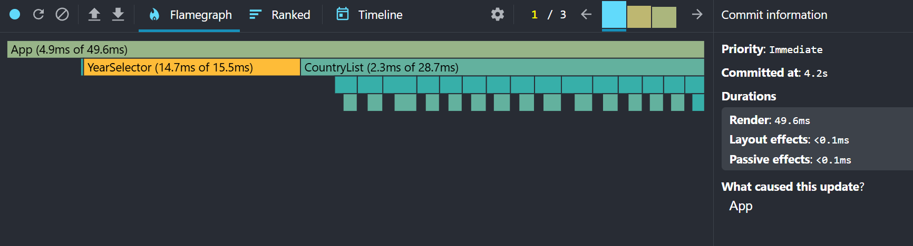
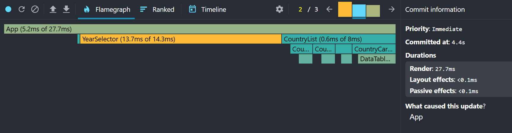
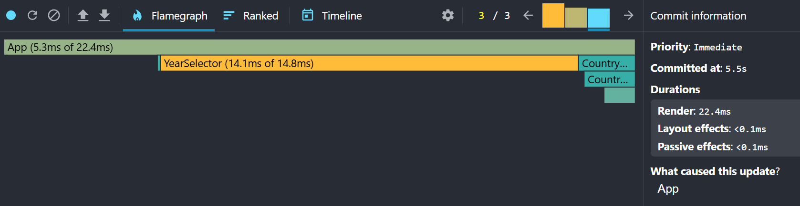

# Performance Optimization Report

## Baseline Measurements

### Interaction A: Sort countries

- **Commit duration**: N/A (The React DevTools version used for profiling does not expose a separate Commit Duration metric.)
- **Render duration**: 368.9ms
- **Screenshot**: 

### Interaction B: Search countries

- **Commit duration**: N/A (The React DevTools version used for profiling does not expose a separate Commit Duration metric.)
- **Render duration**: 49.6ms
- **Screenshot**: 
- **Screenshot**: 
- **Screenshot**: 

### Interaction C: Change year

- **Commit duration**: N/A (The React DevTools version used for profiling does not expose a separate Commit Duration metric.)
- **Render duration**: 420.5ms
- **Screenshot**: 

### Interaction D: Toggle column

- **Commit duration**: N/A (The React DevTools version used for profiling does not expose a separate Commit Duration metric.)
- **Render duration**: 387.6ms
- **Screenshot**: 