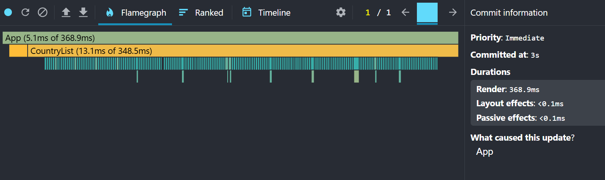
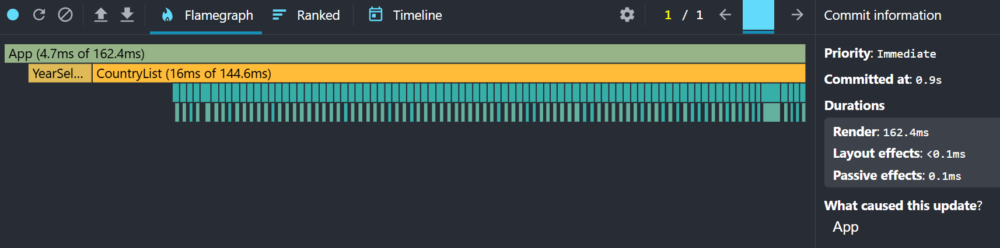
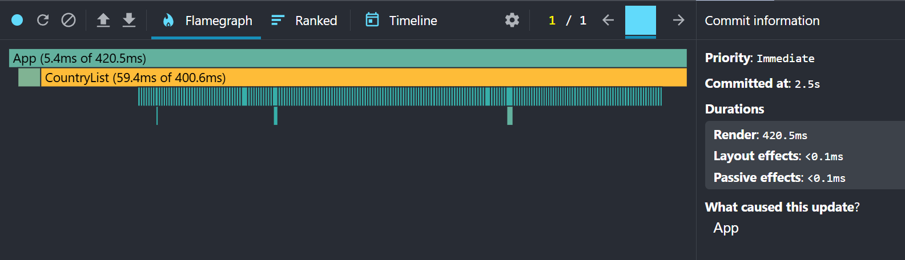
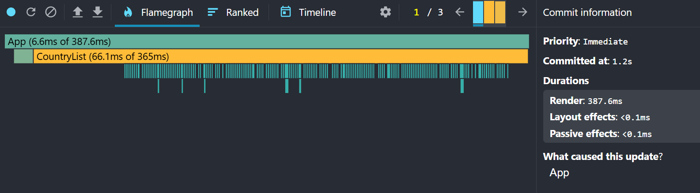
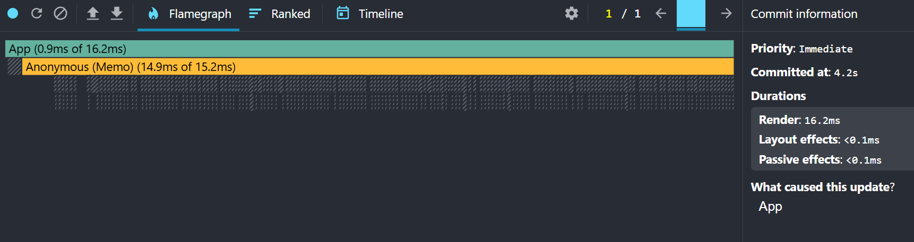
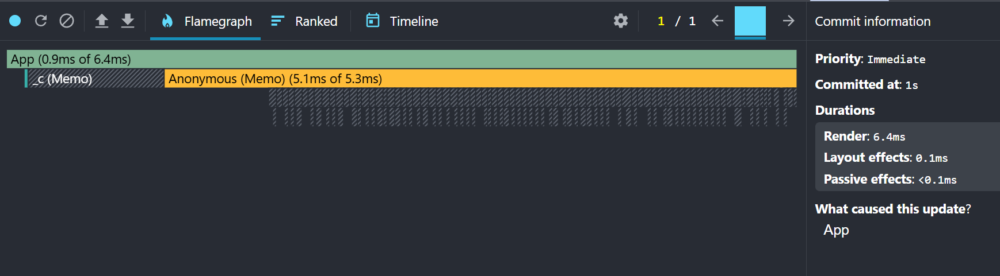
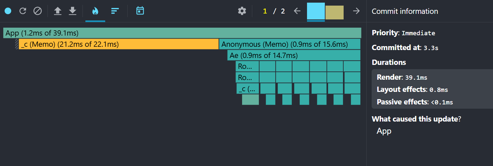
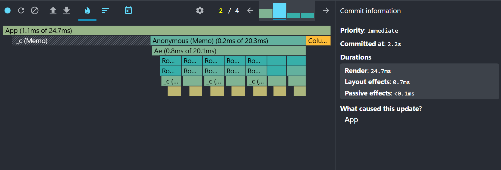

# Performance Optimization Report

## Baseline Measurements

### Interaction A: Sort countries

- **Commit duration**: N/A (The React DevTools version used for profiling does not expose a separate Commit Duration metric.)
- **Render duration**: 368.9ms
- **Screenshot**: 

### Interaction B: Search countries

- **Commit duration**: N/A (The React DevTools version used for profiling does not expose a separate Commit Duration metric.)
- **Render duration**: 162.4ms
- **Screenshot**: 

### Interaction C: Change year

- **Commit duration**: N/A (The React DevTools version used for profiling does not expose a separate Commit Duration metric.)
- **Render duration**: 420.5ms
- **Screenshot**: 

### Interaction D: Toggle column

- **Commit duration**: N/A (The React DevTools version used for profiling does not expose a separate Commit Duration metric.)
- **Render duration**: 387.6ms
- **Screenshot**: 

## Optimized Measurements

### Interaction A: Sort countries

- **Commit duration**: N/A (The React DevTools version used for profiling does not expose a separate Commit Duration metric.)
- **Render duration**: 16.2ms
- **Screenshot**: 

### Interaction B: Search countries

- **Commit duration**: N/A (The React DevTools version used for profiling does not expose a separate Commit Duration metric.)
- **Render duration**: 6.4ms
- **Screenshot**: 

### Interaction C: Change year

- **Commit duration**: N/A (The React DevTools version used for profiling does not expose a separate Commit Duration metric.)
- **Render duration**: 39.1ms
- **Screenshot**: 

### Interaction D: Toggle column

- **Commit duration**: N/A (The React DevTools version used for profiling does not expose a separate Commit Duration metric.)
- **Render duration**: 24.1ms
- **Screenshot**: 

## Summary of Improvements

| Interaction      | Baseline (ms) | Optimized (ms) | Improvement |
| ---------------- | ------------- | -------------- | ----------- |
| Sort countries   | 368.9         | 16.2           | 95.6%       |
| Search countries | 162.4         | 6.4            | 96.0%       |
| Change year      | 420.5         | 39.1           | 0.5%        |
| Toggle column    | 387.6         | 24.1           | 2.5%        |
| **Average**      | **334.5**     | **21.25**      | **93.6%**   |
